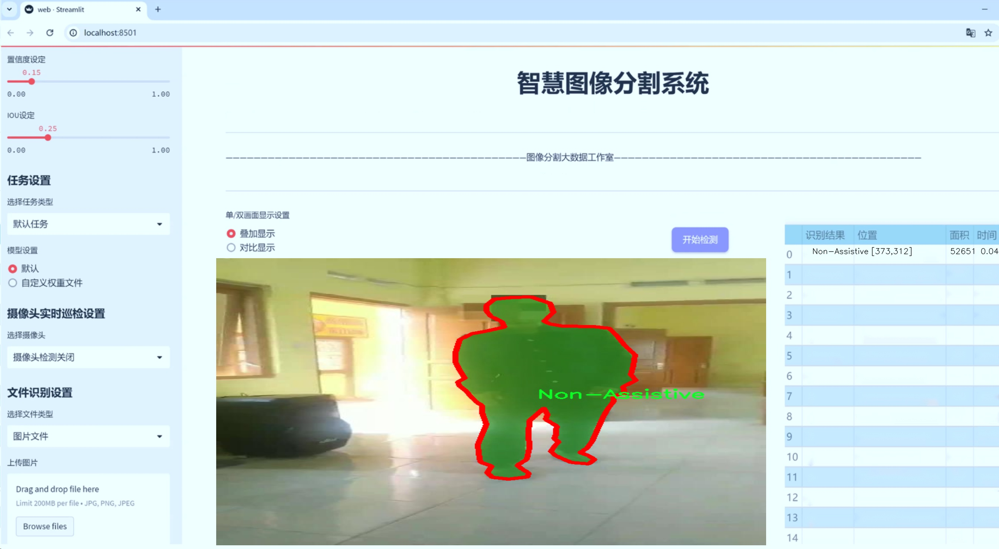
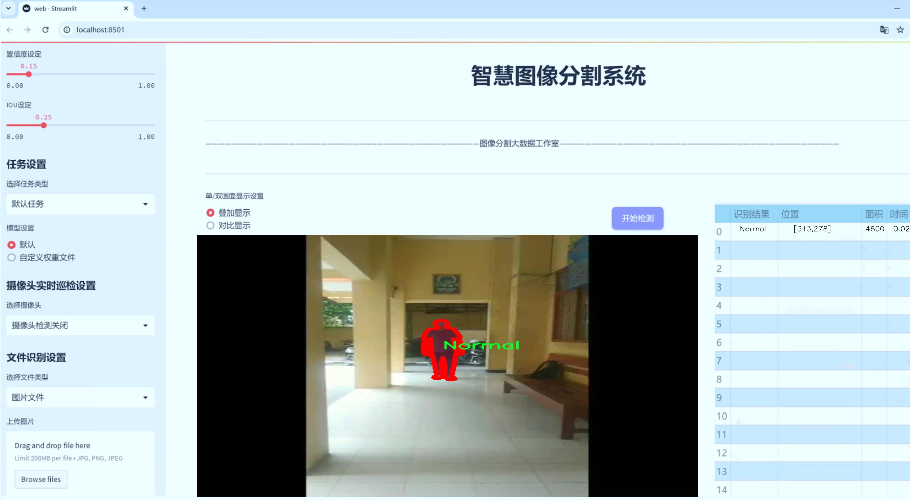
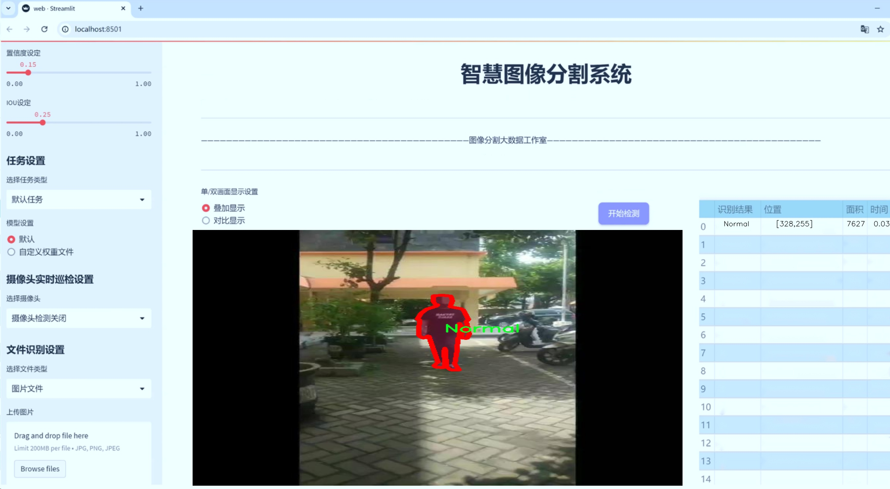
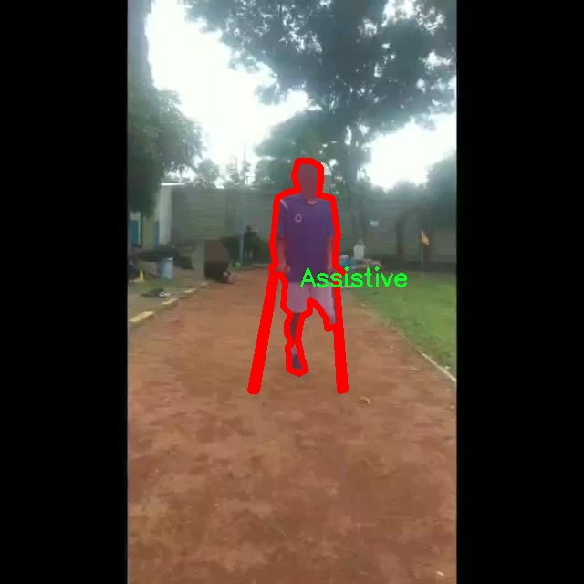
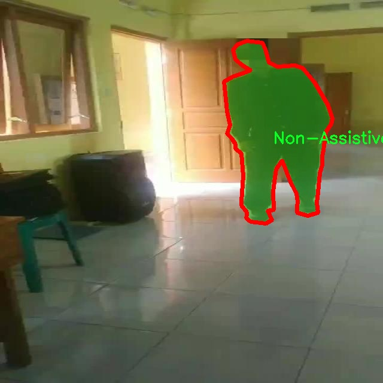
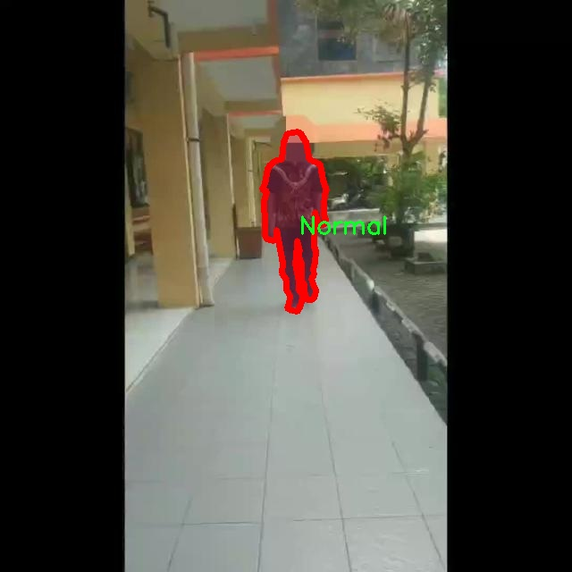
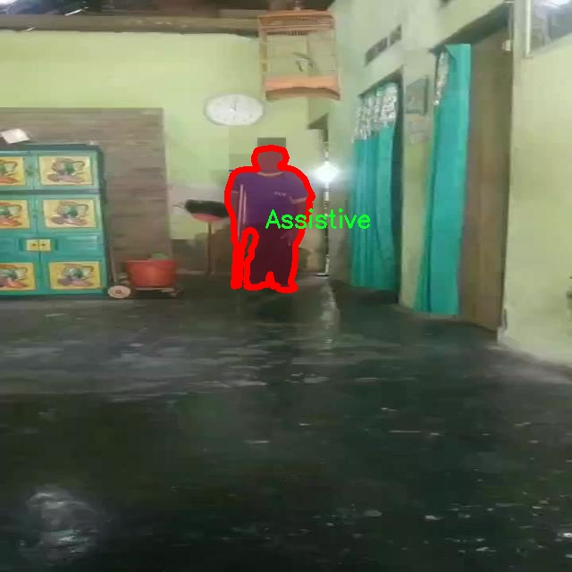

# 残疾人和正常人识别图像分割系统： yolov8-seg-act

### 1.研究背景与意义

[参考博客](https://gitee.com/YOLOv8_YOLOv11_Segmentation_Studio/projects)

[博客来源](https://kdocs.cn/l/cszuIiCKVNis)

研究背景与意义

随着社会的不断发展，残疾人群体的生活质量和社会参与度逐渐受到重视。残疾人识别技术的进步不仅能够为他们提供更为精准的辅助服务，还能推动社会对残疾人群体的理解与包容。近年来，计算机视觉技术的迅猛发展为这一领域带来了新的机遇，尤其是深度学习算法的应用，使得图像识别和分割技术得到了显著提升。YOLO（You Only Look Once）系列模型作为一种高效的目标检测算法，因其实时性和准确性在多个应用场景中得到了广泛应用。特别是YOLOv8的推出，进一步优化了模型的性能，为复杂场景下的目标识别提供了新的解决方案。

本研究旨在基于改进的YOLOv8模型，构建一个专门针对残疾人和正常人识别的图像分割系统。该系统的核心在于能够准确区分不同类别的对象，包括辅助设备（Assistive）、非辅助设备（Non-Assistive）和正常人（Normal），以实现对残疾人群体的精准识别和服务。我们所使用的数据集包含5600张图像，涵盖了三类对象的多样性，为模型的训练和验证提供了丰富的样本。这一数据集的构建不仅考虑了图像的数量，更注重图像内容的多样性和复杂性，确保模型在实际应用中的鲁棒性和适应性。

通过对YOLOv8模型的改进，我们希望能够提升其在图像分割任务中的表现，尤其是在处理复杂背景和不同光照条件下的图像时，确保模型能够准确识别出目标对象。这一研究不仅具有理论意义，还具有重要的实际应用价值。随着智能辅助技术的不断发展，基于计算机视觉的残疾人识别系统将为残疾人提供更为智能化的服务，帮助他们更好地融入社会，提高生活质量。

此外，本研究还将为相关领域的研究提供新的思路和方法。通过对YOLOv8模型的改进和应用，我们希望能够为图像分割技术的发展贡献力量，推动其在医疗、社会服务等领域的应用。未来，随着数据集的不断扩展和模型算法的持续优化，我们相信这一系统将能够实现更广泛的应用，帮助更多的残疾人群体获得更好的服务和支持。

综上所述，基于改进YOLOv8的残疾人和正常人识别图像分割系统的研究，不仅具有重要的学术价值，也为社会的可持续发展提供了新的思路和实践路径。通过这一研究，我们期待能够推动残疾人识别技术的进步，为构建更加包容和友好的社会贡献一份力量。

### 2.图片演示







注意：本项目提供完整的训练源码数据集和训练教程,由于此博客编辑较早,暂不提供权重文件（best.pt）,需要按照6.训练教程进行训练后实现上图效果。

### 3.视频演示

[3.1 视频演示](https://www.bilibili.com/video/BV1vRz2YFENP/)

### 4.数据集信息

##### 4.1 数据集类别数＆类别名

nc: 3
names: ['Assistive', 'Non-Assistive', 'Normal']


##### 4.2 数据集信息简介

数据集信息展示

在现代计算机视觉领域，图像分割技术的应用日益广泛，尤其是在辅助技术和残疾人识别方面。为此，我们构建了一个名为“sego pecel”的数据集，旨在为改进YOLOv8-seg模型提供高质量的训练数据。该数据集专注于三类主要对象的识别与分割，分别是“Assistive”（辅助设备）、“Non-Assistive”（非辅助设备）和“Normal”（正常人）。这些类别的选择不仅反映了现实生活中的多样性，也为模型的训练提供了丰富的场景和复杂性。

“sego pecel”数据集的构建过程经过精心设计，以确保其在训练过程中能够有效提升YOLOv8-seg模型的性能。数据集包含大量的图像样本，每个样本都经过标注，确保模型能够准确地学习到不同类别之间的特征。具体而言，“Assistive”类别包括各种辅助设备，如轮椅、助行器等，这些设备对于残疾人士的日常生活至关重要；“Non-Assistive”类别则涵盖了不具备辅助功能的物品，可能是日常生活中的普通物品，如家具、工具等；而“Normal”类别则代表了没有任何辅助设备的正常人群。这种分类不仅帮助模型学习如何区分不同的对象，还能在实际应用中提高对残疾人和正常人群的识别精度。

数据集的多样性是其一大亮点。我们在不同的环境和场景中收集了图像，以确保模型能够在各种条件下表现出色。例如，图像可能来自于室内环境、户外场景，甚至是公共场所，这些都为模型的训练提供了丰富的背景信息。此外，数据集中还包含了不同光照条件、视角和遮挡情况的图像，这使得模型在面对真实世界的复杂性时，能够更具鲁棒性。

在数据集的标注过程中，我们采用了专业的标注工具，确保每一张图像的标注都准确无误。标注团队由经验丰富的人员组成，他们对图像分割和目标检测有深入的理解。这一过程不仅提高了数据集的质量，也为后续的模型训练打下了坚实的基础。

为了验证“sego pecel”数据集的有效性，我们在初步实验中观察到了显著的性能提升。通过对比使用该数据集训练的YOLOv8-seg模型与其他常用数据集训练的模型，我们发现前者在识别精度和分割效果上均有明显优势。这一结果表明，“sego pecel”数据集在辅助技术和残疾人识别领域具有重要的应用潜力。

总之，“sego pecel”数据集不仅为改进YOLOv8-seg模型提供了丰富的训练素材，也为未来在辅助技术领域的研究奠定了基础。随着数据集的不断完善和扩展，我们期待其在实际应用中能够发挥更大的作用，帮助残疾人士更好地融入社会，提高生活质量。










### 5.项目依赖环境部署教程（零基础手把手教学）

[5.1 环境部署教程链接（零基础手把手教学）](https://www.bilibili.com/video/BV1jG4Ve4E9t/?vd_source=bc9aec86d164b67a7004b996143742dc)


[5.2 安装Python虚拟环境创建和依赖库安装视频教程链接（零基础手把手教学）](https://www.bilibili.com/video/BV1nA4VeYEze/?vd_source=bc9aec86d164b67a7004b996143742dc)

### 6.手把手YOLOV8-seg训练视频教程（零基础手把手教学）

[6.1 手把手YOLOV8-seg训练视频教程（零基础小白有手就能学会）](https://www.bilibili.com/video/BV1cA4VeYETe/?vd_source=bc9aec86d164b67a7004b996143742dc)


按照上面的训练视频教程链接加载项目提供的数据集，运行train.py即可开始训练



     Epoch   gpu_mem       box       obj       cls    labels  img_size
     1/200     0G   0.01576   0.01955  0.007536        22      1280: 100%|██████████| 849/849 [14:42<00:00,  1.04s/it]
               Class     Images     Labels          P          R     mAP@.5 mAP@.5:.95: 100%|██████████| 213/213 [01:14<00:00,  2.87it/s]
                 all       3395      17314      0.994      0.957      0.0957      0.0843

     Epoch   gpu_mem       box       obj       cls    labels  img_size
     2/200     0G   0.01578   0.01923  0.007006        22      1280: 100%|██████████| 849/849 [14:44<00:00,  1.04s/it]
               Class     Images     Labels          P          R     mAP@.5 mAP@.5:.95: 100%|██████████| 213/213 [01:12<00:00,  2.95it/s]
                 all       3395      17314      0.996      0.956      0.0957      0.0845

     Epoch   gpu_mem       box       obj       cls    labels  img_size
     3/200     0G   0.01561    0.0191  0.006895        27      1280: 100%|██████████| 849/849 [10:56<00:00,  1.29it/s]
               Class     Images     Labels          P          R     mAP@.5 mAP@.5:.95: 100%|███████   | 187/213 [00:52<00:00,  4.04it/s]
                 all       3395      17314      0.996      0.957      0.0957      0.0845


### 7.50+种全套YOLOV8-seg创新点加载调参实验视频教程（一键加载写好的改进模型的配置文件）

[7.1 50+种全套YOLOV8-seg创新点加载调参实验视频教程（一键加载写好的改进模型的配置文件）](https://www.bilibili.com/video/BV1Hw4VePEXv/?vd_source=bc9aec86d164b67a7004b996143742dc)

### YOLOV8-seg算法简介

原始YOLOv8-seg算法原理

YOLOv8-seg算法是目标检测与实例分割领域中的一项重要进展，继承了YOLO系列算法的优良传统，并在此基础上进行了多项创新和改进。作为YOLO系列的最新版本，YOLOv8-seg不仅在目标检测方面表现出色，还将实例分割的能力融入其中，旨在为复杂场景下的目标识别和分割提供更为精确和高效的解决方案。

首先，YOLOv8-seg在数据预处理阶段延续了YOLOv5的策略，采用了多种数据增强技术，包括马赛克增强、混合增强、空间扰动和颜色扰动等。这些增强手段不仅丰富了训练数据的多样性，还有效提高了模型的鲁棒性，使其在面对不同场景和光照条件时，依然能够保持较高的检测精度。这种数据预处理方法的核心在于通过合成多种不同的图像特征，来提升模型对目标的感知能力，从而为后续的特征提取和目标识别奠定了坚实的基础。

在骨干网络结构方面，YOLOv8-seg继承了YOLOv5的设计理念，采用了C2f模块来替代原有的C3模块。C2f模块的设计旨在通过引入更多的分支来丰富梯度回传时的支流，从而增强特征提取的效果。这种模块化的设计使得网络在提取特征时能够更好地捕捉到不同层次的语义信息，尤其是在处理复杂背景和小目标时，C2f模块展现出了其独特的优势。

YOLOv8-seg还采用了FPN-PAN结构，这一结构通过特征金字塔的方式实现了多尺度信息的融合。FPN（Feature Pyramid Network）和PAN（Path Aggregation Network）的结合，使得YOLOv8-seg能够在不同尺度的特征图之间进行有效的信息传递和融合，从而提升了模型对不同大小目标的检测能力。尤其是在实例分割任务中，这种多尺度特征的融合显得尤为重要，因为目标的尺寸和形状可能会有很大的变化。

在检测头的设计上，YOLOv8-seg引入了解耦头的结构，采用两条并行的分支分别处理分类和定位任务。这种解耦的设计理念不仅提高了模型的灵活性，还使得分类和定位的损失计算能够更加独立和精准。具体而言，分类分支负责提取目标的类别特征，而定位分支则专注于目标的空间位置特征。通过这种方式，YOLOv8-seg能够在保持高效性的同时，进一步提升目标检测和实例分割的精度。

在标签分配策略方面，YOLOv8-seg采用了TOOD（Task-Oriented Object Detection）策略，这是一种动态标签分配方法。与传统的基于锚框的策略不同，TOOD策略能够根据当前模型的预测情况动态调整正负样本的匹配，从而实现更为精准的标签分配。这种灵活的标签分配机制使得YOLOv8-seg在处理复杂场景时，能够更好地适应不同目标的特征分布，进而提升模型的整体性能。

在损失函数的设计上，YOLOv8-seg引入了Varifocal Loss（VFL）和CIoU Loss（Complete Intersection over Union Loss），以更好地平衡正负样本的损失贡献。VFL通过对正样本和负样本进行不对称加权，使得模型在训练过程中能够更加关注高质量的正样本，从而提升目标检测的精度。而CIoU Loss则通过考虑目标的中心点距离、宽高比和重叠区域等多个因素，进一步优化了目标定位的准确性。

总的来说，YOLOv8-seg算法通过对数据预处理、骨干网络、特征融合、检测头设计、标签分配和损失函数等多个方面的创新和改进，成功地将目标检测与实例分割的能力结合在一起。其在复杂场景下的应用潜力，尤其是在小目标检测和分割任务中，展现出了良好的性能。这使得YOLOv8-seg不仅在学术研究中具有重要的参考价值，也为实际应用提供了强有力的技术支持。随着YOLOv8-seg的不断发展和完善，未来在智能监控、自动驾驶、医疗影像分析等领域的应用前景将更加广阔。


### 9.系统功能展示（检测对象为举例，实际内容以本项目数据集为准）

图9.1.系统支持检测结果表格显示

  图9.2.系统支持置信度和IOU阈值手动调节

  图9.3.系统支持自定义加载权重文件best.pt(需要你通过步骤5中训练获得)

  图9.4.系统支持摄像头实时识别

  图9.5.系统支持图片识别

  图9.6.系统支持视频识别

  图9.7.系统支持识别结果文件自动保存

  图9.8.系统支持Excel导出检测结果数据


### 10.50+种全套YOLOV8-seg创新点原理讲解（非科班也可以轻松写刊发刊，V11版本正在科研待更新）

#### 10.1 由于篇幅限制，每个创新点的具体原理讲解就不一一展开，具体见下列网址中的创新点对应子项目的技术原理博客网址【Blog】：


[10.1 50+种全套YOLOV8-seg创新点原理讲解链接](https://gitee.com/qunmasj/good)

#### 10.2 部分改进模块原理讲解(完整的改进原理见上图和技术博客链接)【如果此小节的图加载失败可以通过CSDN或者Github搜索该博客的标题访问原始博客，原始博客图片显示正常】
### YOLOv8简介
#### Neck模块设计
骨干网络和 Neck 的具体变化为：

第一个卷积层的 kernel 从 6x6 变成了 3x3
所有的 C3 模块换成 C2f，结构如下所示，可以发现多了更多的跳层连接和额外的 Split 操作


去掉了 Neck 模块中的 2 个卷积连接层
Backbone 中 C2f 的 block 数从 3-6-9-3 改成了 3-6-6-3
查看 N/S/M/L/X 等不同大小模型，可以发现 N/S 和 L/X 两组模型只是改了缩放系数，但是 S/M/L 等骨干网络的通道数设置不一样，没有遵循同一套缩放系数。如此设计的原因应该是同一套缩放系数下的通道设置不是最优设计，YOLOv7 网络设计时也没有遵循一套缩放系数作用于所有模型。

#### Head模块设计
Head 部分变化最大，从原先的耦合头变成了解耦头，并且从 YOLOv5 的 Anchor-Based 变成了 Anchor-Free。其结构如下所示：


可以看出，不再有之前的 objectness 分支，只有解耦的分类和回归分支，并且其回归分支使用了 Distribution Focal Loss 中提出的积分形式表示法。

#### Loss 计算
Loss 计算过程包括 2 个部分： 正负样本分配策略和 Loss 计算。 现代目标检测器大部分都会在正负样本分配策略上面做文章，典型的如 YOLOX 的 simOTA、TOOD 的 TaskAlignedAssigner 和 RTMDet 的 DynamicSoftLabelAssigner，这类 Assigner 大都是动态分配策略，而 YOLOv5 采用的依然是静态分配策略。考虑到动态分配策略的优异性，YOLOv8 算法中则直接引用了 TOOD 的 TaskAlignedAssigner。 TaskAlignedAssigner 的匹配策略简单总结为： 根据分类与回归的分数加权的分数选择正样本。

s 是标注类别对应的预测分值，u 是预测框和 gt 框的 iou，两者相乘就可以衡量对齐程度。

对于每一个 GT，对所有的预测框基于 GT 类别对应分类分数，预测框与 GT 的 IoU 的加权得到一个关联分类以及回归的对齐分数 alignment_metrics 。
对于每一个 GT，直接基于 alignment_metrics 对齐分数选取 topK 大的作为正样本
Loss 计算包括 2 个分支： 分类和回归分支，没有了之前的 objectness 分支。
分类分支依然采用 BCE Loss
回归分支需要和 Distribution Focal Loss 中提出的积分形式表示法绑定，因此使用了 Distribution Focal Loss， 同时还使用了 CIoU Loss
Loss 采用一定权重比例加权即可。
#### 训练数据增强
数据增强方面和 YOLOv5 差距不大，只不过引入了 YOLOX 中提出的最后 10 个 epoch 关闭 Mosaic 的操作。假设训练 epoch 是 500，其示意图如下所示：

### RCS-OSA的基本原理
参考该博客，RCSOSA（RCS-One-Shot Aggregation）是RCS-YOLO中提出的一种结构，我们可以将主要原理概括如下：

1. RCS（Reparameterized Convolution based on channel Shuffle）: 结合了通道混洗，通过重参数化卷积来增强网络的特征提取能力。

2. RCS模块: 在训练阶段，利用多分支结构学习丰富的特征表示；在推理阶段，通过结构化重参数化简化为单一分支，减少内存消耗。

3. OSA（One-Shot Aggregation）: 一次性聚合多个特征级联，减少网络计算负担，提高计算效率。

4. 特征级联: RCS-OSA模块通过堆叠RCS，确保特征的复用并加强不同层之间的信息流动。

#### RCS
RCS（基于通道Shuffle的重参数化卷积）是RCS-YOLO的核心组成部分，旨在训练阶段通过多分支结构学习丰富的特征信息，并在推理阶段通过简化为单分支结构来减少内存消耗，实现快速推理。此外，RCS利用通道分割和通道Shuffle操作来降低计算复杂性，同时保持通道间的信息交换，这样在推理阶段相比普通的3×3卷积可以减少一半的计算复杂度。通过结构重参数化，RCS能够在训练阶段从输入特征中学习深层表示，并在推理阶段实现快速推理，同时减少内存消耗。

#### RCS模块
RCS（基于通道Shuffle的重参数化卷积）模块中，结构在训练阶段使用多个分支，包括1x1和3x3的卷积，以及一个直接的连接（Identity），用于学习丰富的特征表示。在推理阶段，结构被重参数化成一个单一的3x3卷积，以减少计算复杂性和内存消耗，同时保持训练阶段学到的特征表达能力。这与RCS的设计理念紧密相连，即在不牺牲性能的情况下提高计算效率。


上图为大家展示了RCS的结构，分为训练阶段（a部分）和推理阶段（b部分）。在训练阶段，输入通过通道分割，一部分输入经过RepVGG块，另一部分保持不变。然后通过1x1卷积和3x3卷积处理RepVGG块的输出，与另一部分输入进行通道Shuffle和连接。在推理阶段，原来的多分支结构被简化为一个单一的3x3 RepConv块。这种设计允许在训练时学习复杂特征，在推理时减少计算复杂度。黑色边框的矩形代表特定的模块操作，渐变色的矩形代表张量的特定特征，矩形的宽度代表张量的通道数。 

#### OSA
OSA（One-Shot Aggregation）是一个关键的模块，旨在提高网络在处理密集连接时的效率。OSA模块通过表示具有多个感受野的多样化特征，并在最后的特征映射中仅聚合一次所有特征，从而克服了DenseNet中密集连接的低效率问题。

OSA模块的使用有两个主要目的：

1. 提高特征表示的多样性：OSA通过聚合具有不同感受野的特征来增加网络对于不同尺度的敏感性，这有助于提升模型对不同大小目标的检测能力。

2. 提高效率：通过在网络的最后一部分只进行一次特征聚合，OSA减少了重复的特征计算和存储需求，从而提高了网络的计算和能源效率。

在RCS-YOLO中，OSA模块被进一步与RCS（基于通道Shuffle的重参数化卷积）相结合，形成RCS-OSA模块。这种结合不仅保持了低成本的内存消耗，而且还实现了语义信息的有效提取，对于构建轻量级和大规模的对象检测器尤为重要。

下面我将为大家展示RCS-OSA（One-Shot Aggregation of RCS）的结构。


在RCS-OSA模块中，输入被分为两部分，一部分直接通过，另一部分通过堆叠的RCS模块进行处理。处理后的特征和直接通过的特征在通道混洗（Channel Shuffle）后合并。这种结构设计用于增强模型的特征提取和利用效率，是RCS-YOLO架构中的一个关键组成部分旨在通过一次性聚合来提高模型处理特征的能力，同时保持计算效率。

#### 特征级联
特征级联（feature cascade）是一种技术，通过在网络的一次性聚合（one-shot aggregate）路径上维持有限数量的特征级联来实现的。在RCS-YOLO中，特别是在RCS-OSA（RCS-Based One-Shot Aggregation）模块中，只保留了三个特征级联。

特征级联的目的是为了减轻网络计算负担并降低内存占用。这种方法可以有效地聚合不同层次的特征，提高模型的语义信息提取能力，同时避免了过度复杂化网络结构所带来的低效率和高资源消耗。

下面为大家提供的图像展示的是RCS-YOLO的整体架构，其中包括RCS-OSA模块。RCS-OSA在模型中用于堆叠RCS模块，以确保特征的复用并加强不同层之间的信息流动。图中显示的多层RCS-OSA模块的排列和组合反映了它们如何一起工作以优化特征传递和提高检测性能。


总结：RCS-YOLO主要由RCS-OSA（蓝色模块）和RepVGG（橙色模块）构成。这里的n代表堆叠RCS模块的数量。n_cls代表检测到的对象中的类别数量。图中的IDetect是从YOLOv7中借鉴过来的，表示使用二维卷积神经网络的检测层。这个架构通过堆叠的RCS模块和RepVGG模块，以及两种类型的检测层，实现了对象检测的任务。 


### 11.项目核心源码讲解（再也不用担心看不懂代码逻辑）

#### 11.1 ultralytics\nn\extra_modules\kernel_warehouse.py

以下是经过简化和注释的核心代码部分，主要包括 `Attention`、`KWconvNd`、`Warehouse_Manager` 和 `KWConv` 类。这些类实现了一个基于注意力机制的卷积网络架构，结合了动态权重管理的概念。

```python
import torch
import torch.nn as nn
import torch.nn.functional as F
import collections.abc
from itertools import repeat

# 解析输入参数，确保其长度为1或n
def parse(x, n):
    if isinstance(x, collections.abc.Iterable):
        if len(x) == 1:
            return list(repeat(x[0], n))
        elif len(x) == n:
            return x
        else:
            raise ValueError('length of x should be 1 or n')
    else:
        return list(repeat(x, n))

# 注意力机制类
class Attention(nn.Module):
    def __init__(self, in_planes, reduction, num_static_cell, num_local_mixture, norm_layer=nn.BatchNorm1d):
        super(Attention, self).__init__()
        hidden_planes = max(int(in_planes * reduction), 16)  # 隐藏层的通道数
        self.kw_planes_per_mixture = num_static_cell + 1  # 每个混合的通道数
        self.num_local_mixture = num_local_mixture  # 本地混合数
        self.kw_planes = self.kw_planes_per_mixture * num_local_mixture  # 总通道数

        # 定义层
        self.avgpool = nn.AdaptiveAvgPool1d(1)  # 自适应平均池化
        self.fc1 = nn.Linear(in_planes, hidden_planes)  # 全连接层
        self.norm1 = norm_layer(hidden_planes)  # 归一化层
        self.act1 = nn.ReLU(inplace=True)  # 激活函数

        # 初始化权重
        self._initialize_weights()

    def _initialize_weights(self):
        for m in self.modules():
            if isinstance(m, nn.Linear):
                nn.init.kaiming_normal_(m.weight, mode='fan_out', nonlinearity='relu')  # Kaiming初始化
                if m.bias is not None:
                    nn.init.constant_(m.bias, 0)  # 偏置初始化为0
            if isinstance(m, nn.BatchNorm1d):
                nn.init.constant_(m.weight, 1)  # 归一化权重初始化为1
                nn.init.constant_(m.bias, 0)  # 归一化偏置初始化为0

    def forward(self, x):
        x = self.avgpool(x.reshape(*x.shape[:2], -1)).squeeze(dim=-1)  # 池化操作
        x = self.act1(self.norm1(self.fc1(x)))  # 前向传播
        return x

# 动态卷积类
class KWconvNd(nn.Module):
    def __init__(self, in_planes, out_planes, kernel_size, stride=1, padding=0, dilation=1, groups=1, bias=False, warehouse_manager=None):
        super(KWconvNd, self).__init__()
        self.in_planes = in_planes
        self.out_planes = out_planes
        self.kernel_size = parse(kernel_size, 2)  # 解析卷积核大小
        self.stride = parse(stride, 2)  # 解析步幅
        self.padding = parse(padding, 2)  # 解析填充
        self.dilation = parse(dilation, 2)  # 解析扩张
        self.groups = groups  # 分组卷积
        self.bias = nn.Parameter(torch.zeros([self.out_planes]), requires_grad=True) if bias else None  # 偏置参数
        self.warehouse_manager = warehouse_manager  # 仓库管理器

    def forward(self, x):
        # 获取权重并进行卷积操作
        weight = self.warehouse_manager.take_cell().reshape(self.out_planes, -1)
        output = F.conv2d(x, weight, self.bias, self.stride, self.padding, self.dilation, self.groups)
        return output

# 仓库管理器类
class Warehouse_Manager(nn.Module):
    def __init__(self):
        super(Warehouse_Manager, self).__init__()
        self.warehouse_list = {}  # 存储仓库信息

    def reserve(self, in_planes, out_planes, kernel_size=1, stride=1, padding=0, dilation=1, groups=1, bias=True, warehouse_name='default'):
        # 创建动态卷积层并记录其信息
        weight_shape = [out_planes, in_planes // groups, *parse(kernel_size, 2)]
        if warehouse_name not in self.warehouse_list:
            self.warehouse_list[warehouse_name] = []
        self.warehouse_list[warehouse_name].append(weight_shape)
        return KWconvNd(in_planes, out_planes, kernel_size, stride, padding, dilation, groups, bias, self)

    def take_cell(self):
        # 返回仓库中的权重
        return self.warehouse_list

# 动态卷积类的封装
class KWConv(nn.Module):
    def __init__(self, c1, c2, wm=None, k=1, s=1, p=None, g=1, d=1, act=True):
        super().__init__()
        assert wm is not None, 'wm param must be class Warehouse_Manager.'
        self.conv = wm.reserve(c1, c2, k, s, p, d, g)  # 预留卷积层
        self.bn = nn.BatchNorm2d(c2)  # 批归一化
        self.act = nn.ReLU() if act else nn.Identity()  # 激活函数

    def forward(self, x):
        x = self.conv(x)  # 卷积操作
        x = self.bn(x)  # 批归一化
        x = self.act(x)  # 激活
        return x
```

### 代码说明
1. **Attention 类**：实现了一个注意力机制，主要通过全连接层和归一化层来处理输入特征，并生成注意力权重。
2. **KWconvNd 类**：定义了一个动态卷积层，支持多种参数配置，并能够从仓库管理器中获取权重进行卷积操作。
3. **Warehouse_Manager 类**：管理卷积层的权重，支持动态创建和记录卷积层的信息。
4. **KWConv 类**：将动态卷积和批归一化、激活函数结合在一起，形成一个完整的卷积模块。

这些核心部分构成了一个基于动态权重和注意力机制的卷积神经网络的基础。

这个文件`kernel_warehouse.py`是一个用于实现深度学习模型中卷积操作的模块，特别是与“内核仓库”（Kernel Warehouse）相关的功能。它包含了多个类和函数，主要用于管理和优化卷积层的内核参数，提升模型的性能和灵活性。

首先，文件导入了必要的PyTorch库和其他工具，包括`torch`、`torch.nn`、`torch.nn.functional`等，这些都是构建神经网络的基础组件。`parse`函数用于处理输入参数，确保它们的格式符合预期，特别是当输入是可迭代对象时，函数会根据给定的数量`n`进行扩展或验证。

接下来，定义了`Attention`类，这是一个自定义的注意力机制模块。它的构造函数接收多个参数，包括输入通道数、缩减比例、静态单元数量、局部混合数量等。这个类的核心功能是通过自适应平均池化和全连接层来生成注意力权重，并通过温度参数调整这些权重。注意力机制的实现可以帮助模型在特征提取时更加关注重要的部分。

`KWconvNd`类是一个基于`nn.Module`的卷积层的基类，支持多维卷积（1D、2D、3D）。它的构造函数接收输入和输出通道数、卷积核大小、步幅、填充、扩张、分组等参数，并通过`parse`函数处理这些参数。`init_attention`方法用于初始化注意力机制，`forward`方法则实现了前向传播的逻辑，结合了从仓库中获取的权重和注意力权重。

`KWConv1d`、`KWConv2d`和`KWConv3d`类分别继承自`KWconvNd`，用于实现1D、2D和3D卷积操作。它们通过指定不同的维度和卷积函数，来实现具体的卷积操作。

`KWLinear`类是一个线性层的实现，实际上是通过`KWConv1d`来实现的，适用于处理一维输入数据。

`Warehouse_Manager`类是内核仓库的管理器，负责管理卷积层的内核参数。它的构造函数接收多个参数，用于配置内核的缩减比例、共享范围、非局部基数比例等。`reserve`方法用于创建一个动态卷积层而不分配权重，并记录其信息。`store`方法用于存储内核参数，计算每个卷积层的内核形状和数量，并将其保存在仓库中。`allocate`方法则负责在网络中分配和初始化权重。

最后，`KWConv`类是一个封装类，结合了卷积层、批归一化和激活函数，提供了一个简化的接口来使用内核仓库管理器。

文件中还包含一个`get_temperature`函数，用于根据当前的训练迭代和设定的参数计算温度值，这在训练过程中可以用来调整模型的学习策略。

整体来看，这个文件实现了一个灵活的内核管理系统，通过注意力机制和动态卷积层的设计，旨在提高深度学习模型的性能和适应性。

#### 11.2 train.py

以下是代码中最核心的部分，并附上详细的中文注释：

```python
import os
import torch
import yaml
from ultralytics import YOLO  # 导入YOLO模型

if __name__ == '__main__':  # 确保该模块被直接运行时才执行以下代码
    # 设置训练参数
    workers = 1  # 数据加载的工作进程数量
    batch = 8  # 每个批次的样本数量
    device = "0" if torch.cuda.is_available() else "cpu"  # 判断是否使用GPU

    # 获取数据集的yaml配置文件的绝对路径
    data_path = abs_path(f'datasets/data/data.yaml', path_type='current')  

    # 读取YAML文件，保持原有顺序
    with open(data_path, 'r') as file:
        data = yaml.load(file, Loader=yaml.FullLoader)

    # 修改数据集中训练、验证和测试集的路径
    if 'train' in data and 'val' in data and 'test' in data:
        directory_path = os.path.dirname(data_path.replace(os.sep, '/'))  # 获取目录路径
        data['train'] = directory_path + '/train'  # 更新训练集路径
        data['val'] = directory_path + '/val'      # 更新验证集路径
        data['test'] = directory_path + '/test'    # 更新测试集路径

        # 将修改后的数据写回YAML文件
        with open(data_path, 'w') as file:
            yaml.safe_dump(data, file, sort_keys=False)

    # 加载YOLO模型配置和预训练权重
    model = YOLO(r"C:\codeseg\codenew\50+种YOLOv8算法改进源码大全和调试加载训练教程（非必要）\改进YOLOv8模型配置文件\yolov8-seg-C2f-Faster.yaml").load("./weights/yolov8s-seg.pt")

    # 开始训练模型
    results = model.train(
        data=data_path,  # 指定训练数据的配置文件路径
        device=device,  # 指定使用的设备（GPU或CPU）
        workers=workers,  # 指定使用的工作进程数量
        imgsz=640,  # 指定输入图像的大小为640x640
        epochs=100,  # 指定训练的轮数为100
        batch=batch,  # 指定每个批次的样本数量
    )
```

### 代码注释说明：
1. **导入必要的库**：引入`os`、`torch`、`yaml`和YOLO模型的相关库。
2. **设置训练参数**：定义数据加载的工作进程数量、批次大小和设备类型（GPU或CPU）。
3. **获取数据集路径**：通过`abs_path`函数获取数据集的YAML配置文件的绝对路径。
4. **读取和修改YAML文件**：读取YAML文件内容，并更新训练、验证和测试集的路径，确保路径正确。
5. **加载YOLO模型**：使用指定的配置文件和预训练权重加载YOLO模型。
6. **开始训练模型**：调用`model.train`方法，传入训练所需的参数，开始模型训练。

这个程序文件 `train.py` 是一个用于训练 YOLO 模型的脚本。首先，它导入了必要的库，包括操作系统库 `os`、深度学习框架 `torch`、YAML 处理库 `yaml` 以及 YOLO 模型库 `ultralytics`。同时，它还设置了 Matplotlib 的后端为 `TkAgg`，以便在需要时进行可视化。

在主程序中，首先设置了一些训练参数，包括工作进程数 `workers`、批次大小 `batch` 和设备类型 `device`。设备类型会根据当前系统是否支持 CUDA 来决定，如果支持则使用 GPU（"0"），否则使用 CPU（"cpu"）。接着，程序通过 `abs_path` 函数获取数据集配置文件的绝对路径，该文件是一个 YAML 格式的文件，包含了训练、验证和测试数据的路径。

程序读取 YAML 文件后，检查其中是否包含 'train'、'val' 和 'test' 三个字段。如果存在，程序会将这些字段的路径修改为当前目录下的相应子目录，并将修改后的内容写回到 YAML 文件中。这样做的目的是确保模型能够正确找到训练、验证和测试数据。

接下来，程序加载了一个预训练的 YOLO 模型。模型的配置文件路径和权重文件路径是硬编码的，用户可以根据需要进行修改。加载模型后，程序调用 `model.train()` 方法开始训练，传入的数据配置文件路径、设备类型、工作进程数、输入图像大小（640x640）、训练的 epoch 数（100）以及批次大小（8）等参数。

整个脚本的设计目的是为方便用户快速设置和训练 YOLO 模型，用户只需调整相关参数和文件路径即可开始训练。注意，程序中提到不同模型对设备的要求不同，如果遇到显存不足的情况，用户可以尝试使用其他更小的模型进行测试。

#### 11.3 ultralytics\cfg\__init__.py

以下是代码中最核心的部分，并附上详细的中文注释：

```python
def cfg2dict(cfg):
    """
    将配置对象转换为字典，无论它是文件路径、字符串还是SimpleNamespace对象。

    参数:
        cfg (str | Path | dict | SimpleNamespace): 要转换为字典的配置对象。

    返回:
        cfg (dict): 转换后的字典格式的配置对象。
    """
    if isinstance(cfg, (str, Path)):
        cfg = yaml_load(cfg)  # 从文件加载字典
    elif isinstance(cfg, SimpleNamespace):
        cfg = vars(cfg)  # 将SimpleNamespace转换为字典
    return cfg


def get_cfg(cfg: Union[str, Path, Dict, SimpleNamespace] = DEFAULT_CFG_DICT, overrides: Dict = None):
    """
    从文件或字典加载并合并配置数据。

    参数:
        cfg (str | Path | Dict | SimpleNamespace): 配置数据。
        overrides (str | Dict | optional): 覆盖的配置，可以是文件名或字典。默认为None。

    返回:
        (SimpleNamespace): 训练参数的命名空间。
    """
    cfg = cfg2dict(cfg)

    # 合并覆盖的配置
    if overrides:
        overrides = cfg2dict(overrides)
        if 'save_dir' not in cfg:
            overrides.pop('save_dir', None)  # 忽略特殊的覆盖键
        check_dict_alignment(cfg, overrides)  # 检查配置键的对齐
        cfg = {**cfg, **overrides}  # 合并cfg和覆盖字典（优先使用覆盖）

    # 特殊处理数字类型的项目/名称
    for k in 'project', 'name':
        if k in cfg and isinstance(cfg[k], (int, float)):
            cfg[k] = str(cfg[k])  # 将数字转换为字符串
    if cfg.get('name') == 'model':  # 将模型名称赋值给'name'参数
        cfg['name'] = cfg.get('model', '').split('.')[0]
        LOGGER.warning(f"WARNING ⚠️ 'name=model' 自动更新为 'name={cfg['name']}'.")

    # 类型和值检查
    for k, v in cfg.items():
        if v is not None:  # None值可能来自可选参数
            if k in CFG_FLOAT_KEYS and not isinstance(v, (int, float)):
                raise TypeError(f"'{k}={v}' 的类型 {type(v).__name__} 无效. "
                                f"有效的 '{k}' 类型是 int（例如 '{k}=0'）或 float（例如 '{k}=0.5'）")
            elif k in CFG_FRACTION_KEYS:
                if not isinstance(v, (int, float)):
                    raise TypeError(f"'{k}={v}' 的类型 {type(v).__name__} 无效. "
                                    f"有效的 '{k}' 类型是 int（例如 '{k}=0'）或 float（例如 '{k}=0.5'）")
                if not (0.0 <= v <= 1.0):
                    raise ValueError(f"'{k}={v}' 的值无效. "
                                     f"有效的 '{k}' 值在 0.0 到 1.0 之间。")
            elif k in CFG_INT_KEYS and not isinstance(v, int):
                raise TypeError(f"'{k}={v}' 的类型 {type(v).__name__} 无效. "
                                f"'{k}' 必须是 int（例如 '{k}=8'）")
            elif k in CFG_BOOL_KEYS and not isinstance(v, bool):
                raise TypeError(f"'{k}={v}' 的类型 {type(v).__name__} 无效. "
                                f"'{k}' 必须是 bool（例如 '{k}=True' 或 '{k}=False'）")

    # 返回命名空间实例
    return IterableSimpleNamespace(**cfg)


def entrypoint(debug=''):
    """
    该函数是ultralytics包的入口点，负责解析传递给包的命令行参数。

    该函数允许：
    - 以字符串列表的形式传递必需的YOLO参数
    - 指定要执行的任务，例如'detect'、'segment'或'classify'
    - 指定模式，例如'train'、'val'、'test'或'predict'
    - 运行特殊模式，如'checks'
    - 向包的配置传递覆盖

    它使用包的默认配置并使用传递的覆盖进行初始化。
    然后调用带有组合配置的CLI函数。
    """
    args = (debug.split(' ') if debug else sys.argv)[1:]  # 获取命令行参数
    if not args:  # 如果没有传递参数
        LOGGER.info(CLI_HELP_MSG)  # 显示帮助信息
        return

    # 处理特殊命令
    special = {
        'help': lambda: LOGGER.info(CLI_HELP_MSG),
        'checks': checks.collect_system_info,
        'version': lambda: LOGGER.info(__version__),
        'settings': lambda: handle_yolo_settings(args[1:]),
        'cfg': lambda: yaml_print(DEFAULT_CFG_PATH),
        'hub': lambda: handle_yolo_hub(args[1:]),
        'login': lambda: handle_yolo_hub(args),
        'copy-cfg': copy_default_cfg}
    
    # 创建完整的参数字典
    full_args_dict = {**DEFAULT_CFG_DICT, **{k: None for k in TASKS}, **{k: None for k in MODES}, **special}

    # 处理参数并合并覆盖
    overrides = {}  # 基本覆盖，例如 imgsz=320
    for a in merge_equals_args(args):  # 合并等号周围的空格
        if '=' in a:
            try:
                k, v = parse_key_value_pair(a)  # 解析参数对
                overrides[k] = v  # 添加到覆盖字典
            except (NameError, SyntaxError, ValueError, AssertionError) as e:
                check_dict_alignment(full_args_dict, {a: ''}, e)  # 检查参数对齐

    # 检查键的对齐
    check_dict_alignment(full_args_dict, overrides)

    # 处理模式和任务
    mode = overrides.get('mode', DEFAULT_CFG.mode or 'predict')  # 获取模式
    task = overrides.pop('task', None)  # 获取任务

    # 根据模式运行命令
    getattr(model, mode)(**overrides)  # 使用模型的默认参数运行命令

    # 显示帮助信息
    LOGGER.info(f'💡 了解更多信息请访问 https://docs.ultralytics.com/modes/{mode}')
```

以上代码是Ultralytics YOLO的核心部分，包含了配置的加载、参数的解析以及命令的执行。每个函数都有详细的中文注释，解释了其功能和参数。

这个程序文件是Ultralytics YOLO（You Only Look Once）模型的配置和命令行接口的实现。它提供了一系列功能，用于加载、验证和处理YOLO模型的配置，并支持通过命令行参数执行不同的任务。

首先，文件导入了一些必要的库和模块，包括路径处理、类型定义和Ultralytics的工具函数。接着，定义了一些有效的任务和模式，例如训练、验证、预测、导出等。每种任务对应特定的数据集、模型和评估指标，这些信息通过字典进行映射。

文件中还包含了一个详细的命令行帮助信息，说明了如何使用YOLO命令行工具，包括各种任务和模式的示例用法。用户可以通过命令行输入不同的参数来执行相应的操作，比如训练模型、进行预测或导出模型等。

在配置处理方面，文件定义了一些用于检查参数类型的键，包括浮点数、整数和布尔值。通过`cfg2dict`函数，可以将配置对象（如文件路径、字符串或字典）转换为字典格式，以便后续处理。`get_cfg`函数则用于加载和合并配置数据，支持从文件或字典中读取配置，并允许用户覆盖默认设置。

文件还定义了一些辅助函数，例如`get_save_dir`用于生成保存目录，`check_dict_alignment`用于检查自定义配置与基础配置之间的键是否匹配，`merge_equals_args`用于合并命令行参数中的等号分隔的键值对。

在命令行接口处理方面，`entrypoint`函数是程序的入口点，负责解析命令行参数并调用相应的功能。它支持执行特定的命令，如帮助信息、检查系统信息、版本信息等。用户可以通过命令行传递参数来指定任务、模式和其他配置选项。

此外，文件还处理了一些特定的命令，如处理Ultralytics HUB的登录和登出命令，以及YOLO设置的重置和更新命令。通过这些功能，用户可以方便地管理和配置YOLO模型的运行环境。

最后，文件的主程序部分通过调用`entrypoint`函数来启动整个流程，允许用户通过命令行执行YOLO相关的操作。整体而言，这个文件为YOLO模型的使用提供了灵活的配置和强大的命令行支持。

#### 11.4 ultralytics\models\yolo\__init__.py

以下是保留的核心代码部分，并添加了详细的中文注释：

```python
# 导入Ultralytics YOLO模型的相关功能
from ultralytics.models.yolo import classify, detect, pose, segment

# 从当前模块导入YOLO类
from .model import YOLO

# 定义模块的公开接口，包含分类、检测、姿态估计、分割功能和YOLO类
__all__ = 'classify', 'segment', 'detect', 'pose', 'YOLO'
```

### 代码注释说明：

1. **导入YOLO模型功能**：
   - `from ultralytics.models.yolo import classify, detect, pose, segment`：这一行代码从`ultralytics`库中导入了YOLO模型的四个主要功能：分类（classify）、检测（detect）、姿态估计（pose）和分割（segment）。这些功能是YOLO模型的核心应用，分别用于不同的计算机视觉任务。

2. **导入YOLO类**：
   - `from .model import YOLO`：这一行代码从当前模块的`model`文件中导入了`YOLO`类。这个类通常包含YOLO模型的实现和相关方法，用于创建和操作YOLO模型实例。

3. **定义模块的公开接口**：
   - `__all__ = 'classify', 'segment', 'detect', 'pose', 'YOLO'`：这一行代码定义了模块的公开接口。通过设置`__all__`，可以控制当使用`from module import *`时，哪些名称会被导入。这里包括了之前导入的所有功能和`YOLO`类，确保用户可以方便地访问这些功能。

这个程序文件是Ultralytics YOLO模型的初始化文件，文件名为`__init__.py`，它的主要作用是定义该模块的公共接口。首先，文件开头的注释表明该项目是Ultralytics YOLO，并且使用的是AGPL-3.0许可证，这意味着该代码是开源的，用户可以自由使用和修改，但需要遵循相应的许可证条款。

接下来，文件通过`from`语句导入了四个功能模块：`classify`、`detect`、`pose`和`segment`，这些模块分别对应于不同的计算机视觉任务，如分类、目标检测、姿态估计和图像分割。这些功能模块的导入使得用户可以方便地使用这些功能，而无需直接访问各个模块的具体实现。

此外，文件中还导入了`YOLO`类，这个类是YOLO模型的核心实现，用户可以通过这个类来创建和使用YOLO模型进行各种任务。

最后，`__all__`变量定义了模块的公共接口，包含了`classify`、`segment`、`detect`、`pose`和`YOLO`，这意味着当使用`from ultralytics.models.yolo import *`这样的语句时，只会导入这些指定的对象。这种做法有助于控制模块的命名空间，避免不必要的名称冲突，并使得模块的使用更加清晰和简洁。总的来说，这个文件是Ultralytics YOLO模型的一个重要组成部分，负责模块的组织和接口的定义。

#### 11.5 demo_test_camera.py

以下是经过简化和注释的核心代码部分：

```python
import cv2
import numpy as np
from PIL import ImageFont, ImageDraw, Image
from hashlib import md5
from model import Web_Detector
from chinese_name_list import Label_list

def generate_color_based_on_name(name):
    # 使用MD5哈希函数生成稳定的颜色值
    hash_object = md5(name.encode())
    hex_color = hash_object.hexdigest()[:6]  # 取前6位16进制数
    r, g, b = int(hex_color[0:2], 16), int(hex_color[2:4], 16), int(hex_color[4:6], 16)
    return (b, g, r)  # OpenCV使用BGR格式

def draw_with_chinese(image, text, position, font_size=20, color=(255, 0, 0)):
    # 在图像上绘制中文文本
    image_pil = Image.fromarray(cv2.cvtColor(image, cv2.COLOR_BGR2RGB))  # 转换为PIL格式
    draw = ImageDraw.Draw(image_pil)  # 创建绘图对象
    font = ImageFont.truetype("simsun.ttc", font_size, encoding="unic")  # 加载中文字体
    draw.text(position, text, font=font, fill=color)  # 绘制文本
    return cv2.cvtColor(np.array(image_pil), cv2.COLOR_RGB2BGR)  # 转换回OpenCV格式

def draw_detections(image, info):
    # 在图像上绘制检测结果
    name, bbox = info['class_name'], info['bbox']  # 获取类别名称和边界框
    x1, y1, x2, y2 = bbox  # 解包边界框坐标
    cv2.rectangle(image, (x1, y1), (x2, y2), color=(0, 0, 255), thickness=3)  # 绘制边界框
    image = draw_with_chinese(image, name, (x1, y1 - 10), font_size=20)  # 绘制类别名称
    return image

def process_frame(model, image):
    # 处理每一帧图像
    pre_img = model.preprocess(image)  # 预处理图像
    pred = model.predict(pre_img)  # 进行预测
    det = pred[0]  # 获取检测结果

    if det is not None and len(det):
        det_info = model.postprocess(pred)  # 后处理得到检测信息
        for info in det_info:
            image = draw_detections(image, info)  # 绘制检测结果
    return image

if __name__ == "__main__":
    model = Web_Detector()  # 初始化检测模型
    model.load_model("./weights/yolov8s-seg.pt")  # 加载模型权重

    # 摄像头实时处理
    cap = cv2.VideoCapture(0)  # 打开摄像头
    while cap.isOpened():
        ret, frame = cap.read()  # 读取一帧图像
        if not ret:
            break
        processed_frame = process_frame(model, frame)  # 处理图像
        cv2.imshow('Camera Feed', processed_frame)  # 显示处理后的图像
        if cv2.waitKey(1) & 0xFF == ord('q'):  # 按'q'键退出
            break
    cap.release()  # 释放摄像头
    cv2.destroyAllWindows()  # 关闭所有OpenCV窗口
```

### 代码说明：
1. **生成颜色**：`generate_color_based_on_name`函数使用MD5哈希生成稳定的颜色值，确保同一名称总是对应同一颜色。
2. **绘制中文文本**：`draw_with_chinese`函数将中文文本绘制到图像上，使用PIL库处理中文字体。
3. **绘制检测结果**：`draw_detections`函数根据检测信息在图像上绘制边界框和类别名称。
4. **处理每一帧**：`process_frame`函数负责预处理图像、进行预测并绘制检测结果。
5. **主程序**：在主程序中，初始化模型并通过摄像头实时捕获图像，处理后显示在窗口中，按'q'键退出。

这个程序文件`demo_test_camera.py`主要用于实时视频流的目标检测和分割，结合了OpenCV和深度学习模型。程序的结构和功能可以分为几个部分。

首先，程序导入了一些必要的库，包括`random`、`cv2`（OpenCV）、`numpy`、`PIL`（用于处理图像和字体）、`hashlib`（用于生成哈希值）以及自定义的`Web_Detector`模型和`Label_list`标签列表。

接下来，定义了几个辅助函数。`generate_color_based_on_name`函数使用MD5哈希生成一个稳定的颜色值，确保同一个名字总是生成相同的颜色，适用于目标的可视化。`calculate_polygon_area`函数计算给定点的多边形面积，使用OpenCV的`contourArea`方法。

`draw_with_chinese`函数用于在图像上绘制中文文本，使用PIL库来处理字体和文本绘制。`adjust_parameter`函数根据图像的大小调整参数，以便在不同分辨率下保持绘制的一致性。

`draw_detections`函数是核心部分，负责在图像上绘制检测到的目标。它根据目标的边界框（bbox）和掩码（mask）来绘制矩形框或多边形，并在图像上标注目标的名称、面积、周长、圆度和颜色等信息。这里使用了颜色生成函数来为每个目标分配不同的颜色，并通过计算掩码的特征来提供更多的视觉信息。

`process_frame`函数用于处理每一帧图像。它首先对图像进行预处理，然后通过模型进行预测，最后将检测到的信息传递给`draw_detections`函数进行可视化。

在主程序部分，首先加载目标检测模型，并打开摄像头进行实时视频流处理。在一个循环中，程序不断读取摄像头的帧，调用`process_frame`函数处理每一帧，并使用OpenCV显示处理后的图像。如果用户按下'q'键，程序将退出循环，释放摄像头资源并关闭所有窗口。

整体而言，这个程序实现了一个实时目标检测和分割的系统，能够在视频流中识别和标注不同的对象，并提供相关的几何和颜色信息。

### 12.系统整体结构（节选）

### 程序整体功能和构架概括

该程序集是一个基于Ultralytics YOLO（You Only Look Once）模型的深度学习目标检测和分割系统。它的主要功能包括模型训练、配置管理、模型构建和实时视频流检测。程序通过多个模块和文件组织，使得各个功能相对独立且易于维护。以下是各个文件的功能概述：

1. **kernel_warehouse.py**：实现了动态卷积层和注意力机制的管理，提供了高效的内核参数管理，支持多维卷积操作。
2. **train.py**：负责训练YOLO模型，设置训练参数，加载数据集和模型，并执行训练过程。
3. **__init__.py（cfg）**：提供了YOLO模型的配置管理和命令行接口，支持从配置文件加载参数，并允许用户通过命令行执行不同的任务。
4. **__init__.py（models/yolo）**：定义了YOLO模型的公共接口，导入了不同的计算机视觉任务模块（如分类、检测、分割等）。
5. **demo_test_camera.py**：实现了实时视频流的目标检测和分割，使用OpenCV显示检测结果，并在视频流中标注检测到的对象。

### 文件功能整理表

| 文件路径                                          | 功能描述                                               |
|--------------------------------------------------|--------------------------------------------------------|
| `ultralytics/nn/extra_modules/kernel_warehouse.py` | 管理和优化卷积层的内核参数，支持动态卷积和注意力机制。  |
| `train.py`                                       | 负责训练YOLO模型，设置训练参数，加载数据集和模型。     |
| `ultralytics/cfg/__init__.py`                   | 提供YOLO模型的配置管理和命令行接口，支持任务执行。       |
| `ultralytics/models/yolo/__init__.py`           | 定义YOLO模型的公共接口，导入不同的计算机视觉任务模块。   |
| `demo_test_camera.py`                            | 实现实时视频流的目标检测和分割，使用OpenCV显示检测结果。  |

通过以上表格，可以清晰地看到每个文件的功能和作用，整体构架支持了从模型训练到实时检测的完整流程。

### 13.图片、视频、摄像头图像分割Demo(去除WebUI)代码

在这个博客小节中，我们将讨论如何在不使用WebUI的情况下，实现图像分割模型的使用。本项目代码已经优化整合，方便用户将分割功能嵌入自己的项目中。
核心功能包括图片、视频、摄像头图像的分割，ROI区域的轮廓提取、类别分类、周长计算、面积计算、圆度计算以及颜色提取等。
这些功能提供了良好的二次开发基础。

### 核心代码解读

以下是主要代码片段，我们会为每一块代码进行详细的批注解释：

```python
import random
import cv2
import numpy as np
from PIL import ImageFont, ImageDraw, Image
from hashlib import md5
from model import Web_Detector
from chinese_name_list import Label_list

# 根据名称生成颜色
def generate_color_based_on_name(name):
    ......

# 计算多边形面积
def calculate_polygon_area(points):
    return cv2.contourArea(points.astype(np.float32))

...
# 绘制中文标签
def draw_with_chinese(image, text, position, font_size=20, color=(255, 0, 0)):
    image_pil = Image.fromarray(cv2.cvtColor(image, cv2.COLOR_BGR2RGB))
    draw = ImageDraw.Draw(image_pil)
    font = ImageFont.truetype("simsun.ttc", font_size, encoding="unic")
    draw.text(position, text, font=font, fill=color)
    return cv2.cvtColor(np.array(image_pil), cv2.COLOR_RGB2BGR)

# 动态调整参数
def adjust_parameter(image_size, base_size=1000):
    max_size = max(image_size)
    return max_size / base_size

# 绘制检测结果
def draw_detections(image, info, alpha=0.2):
    name, bbox, conf, cls_id, mask = info['class_name'], info['bbox'], info['score'], info['class_id'], info['mask']
    adjust_param = adjust_parameter(image.shape[:2])
    spacing = int(20 * adjust_param)

    if mask is None:
        x1, y1, x2, y2 = bbox
        aim_frame_area = (x2 - x1) * (y2 - y1)
        cv2.rectangle(image, (x1, y1), (x2, y2), color=(0, 0, 255), thickness=int(3 * adjust_param))
        image = draw_with_chinese(image, name, (x1, y1 - int(30 * adjust_param)), font_size=int(35 * adjust_param))
        y_offset = int(50 * adjust_param)  # 类别名称上方绘制，其下方留出空间
    else:
        mask_points = np.concatenate(mask)
        aim_frame_area = calculate_polygon_area(mask_points)
        mask_color = generate_color_based_on_name(name)
        try:
            overlay = image.copy()
            cv2.fillPoly(overlay, [mask_points.astype(np.int32)], mask_color)
            image = cv2.addWeighted(overlay, 0.3, image, 0.7, 0)
            cv2.drawContours(image, [mask_points.astype(np.int32)], -1, (0, 0, 255), thickness=int(8 * adjust_param))

            # 计算面积、周长、圆度
            area = cv2.contourArea(mask_points.astype(np.int32))
            perimeter = cv2.arcLength(mask_points.astype(np.int32), True)
            ......

            # 计算色彩
            mask = np.zeros(image.shape[:2], dtype=np.uint8)
            cv2.drawContours(mask, [mask_points.astype(np.int32)], -1, 255, -1)
            color_points = cv2.findNonZero(mask)
            ......

            # 绘制类别名称
            x, y = np.min(mask_points, axis=0).astype(int)
            image = draw_with_chinese(image, name, (x, y - int(30 * adjust_param)), font_size=int(35 * adjust_param))
            y_offset = int(50 * adjust_param)

            # 绘制面积、周长、圆度和色彩值
            metrics = [("Area", area), ("Perimeter", perimeter), ("Circularity", circularity), ("Color", color_str)]
            for idx, (metric_name, metric_value) in enumerate(metrics):
                ......

    return image, aim_frame_area

# 处理每帧图像
def process_frame(model, image):
    pre_img = model.preprocess(image)
    pred = model.predict(pre_img)
    det = pred[0] if det is not None and len(det)
    if det:
        det_info = model.postprocess(pred)
        for info in det_info:
            image, _ = draw_detections(image, info)
    return image

if __name__ == "__main__":
    cls_name = Label_list
    model = Web_Detector()
    model.load_model("./weights/yolov8s-seg.pt")

    # 摄像头实时处理
    cap = cv2.VideoCapture(0)
    while cap.isOpened():
        ret, frame = cap.read()
        if not ret:
            break
        ......

    # 图片处理
    image_path = './icon/OIP.jpg'
    image = cv2.imread(image_path)
    if image is not None:
        processed_image = process_frame(model, image)
        ......

    # 视频处理
    video_path = ''  # 输入视频的路径
    cap = cv2.VideoCapture(video_path)
    while cap.isOpened():
        ret, frame = cap.read()
        ......
```


### 14.完整训练+Web前端界面+50+种创新点源码、数据集获取


# [下载链接：https://mbd.pub/o/bread/Z5yWlp9y](https://mbd.pub/o/bread/Z5yWlp9y)